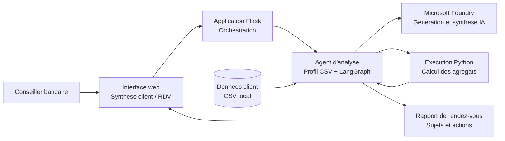
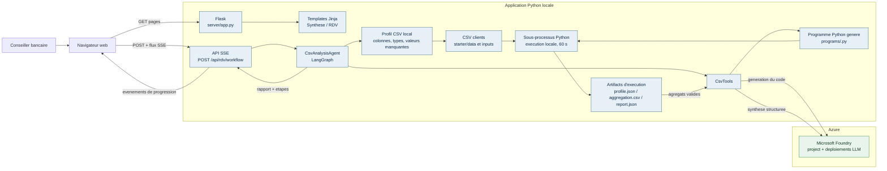

# Architecture

Le diagramme ci-dessous represente l'architecture actuelle du prototype et le
workflow de preparation d'un rendez-vous.

## Schema de principe

Ce schema resume le principe : l'application orchestre l'analyse des donnees
client, Foundry fournit les capacites IA, puis le resultat est restitue au
conseiller dans l'interface web.

## Vue technique

## Workflow de preparation du rendez-vous

1. Le navigateur ouvre la page client puis appelle l'endpoint SSE avec le
   client selectionne.
2. Flask charge le CSV du client et cree un repertoire d'execution dedie.
3. Le profil est calcule localement ; les lignes brutes ne sont pas envoyees a
   Foundry pour cette etape.
4. Foundry genere un programme Python a partir de l'objectif et du profil.
5. Le programme est valide, sauvegarde, puis execute localement sur le CSV
   normalise.
6. Les agregats produits sont valides avant d'etre envoyes a Foundry pour la
   synthese structuree.
7. Le rapport et les etapes suggerees sont renvoyes au navigateur via SSE.

Les ressources Blob Storage, Cosmos DB et Azure AI Search sont bien creees par
`infra/main.bicep`, mais ne sont pas encore utilisees par le workflow de
`starter`.